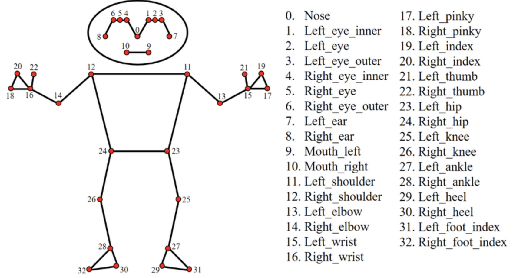

# 🎻 협주가능 악기 레슨 Agent AI 플랫폼 기술 개발

멀티 에이전트 기반으로 동작하는 **실시간 음악 학습 AI 시스템**을 개발하는 프로젝트.

사용자의 연주 데이터를 분석하여 **음정, 박자, 자세**를 종합적으로 피드백하고,
최종적으로 **협주(co-performance)**까지 지원하는 것을 목표로 삼고 진행.

A project to develop **a real-time music learning AI system** based on a multi-agent architecture.

It analyzes a user's performance data to provide integrated feedback on **pitch, rhythm, and posture**, with the ultimate goal of enabling AI-assisted co-performance (ensemble play).

---

## 🚀 Project Outline

본 프로젝트는 단일 모델이 아닌 **Multi-Agent Architecture**를 기반: 각 에이전트는 특정 역할을 수행하며, 협력하여 더 정교한 피드백을 생성.

### 🎯 Goals

- 실시간 연주 데이터 분석 (Multimodal: video + audio)
- 개별 요소별 피드백 제공 (Pitch, Rhythm, Pose)
- 통합 피드백 생성 및 학습 가이드 제공
- AI 기반 협주(Ensemble) 지원

## 🧠 System Architecture

```
User Input (Video + Audio)
        ↓
 ┌───────────────────────┐
 │  Multi-Agent System   │
 └───────────────────────┘
   ↓        ↓        ↓
Pitch    Rhythm    Pose
Agent    Agent     Agent
   ↓        ↓        ↓
     Supervisor Agent
                ↓
    Orchestration Agent
                ↓
  Final Feedback & Ensemble
```

## 🤖 Pose Agent

- 연주 자세 분석 (영상 기반)
- Mediapipe 등을 활용한 관절/포즈 추출
- 올바른 자세 가이드 제공
- 실시간 피드백 생성

💗 Pose Agent 개발 및 설계 일지 👉 [HERE](https://oiblog.tistory.com/category/%EC%9E%90%EA%B8%B0%EA%B0%9C%EB%B0%9C/%ED%83%90%EA%B5%AC)

### Architecture of Pose Agent

```
PoseAgent
├── PoseExtractor (MediaPipe)
├── FeatureExtractor
├── PostureModel (TCN)
└── FeedbackGenerator (Rule-based)
```

### Pose-Agent Structure

```
CD_PoseAgent/
├── main.py                      # 전체 흐름 제어
├── pose_extractor.py            # 웹캠 + mediapipe + keypoints 추출
├── feature_extractor.py         # feature 계산
└── pose_landmarker_lite.task
```

### Supervisor Agent

- 각 에이전트의 결과를 종합
- 사용자에게 전달할 최종 피드백 생성

### Orchestration Agent

- AI 기반 협주 기능
- 사용자 연주에 맞춰 반주/합주 생성

---

## 🛠️ Skills/Models for Pose Agent

- **Python**
- **Mediapipe** (Pose Estimation)
- **OpenCV**
- **Pytorch**
- **TCN**
- **CNN**

### Keypoints of Mediapipe



## 🔍 현재 진행 상황

- [x] Mediapipe 기반 Pose 추출 테스트
- [x] Pose Agent 프로토타입 구현
- [x] Feature 확정 및 계산 로직 구현
- [x] 좋은 자세와 나쁜 자세에 대한 데이터셋 만들기
- [x] 생성한 데이터셋 분석
- [ ] TCN 설계 및 학습 계획 구체화
- [ ] Rule-based를 위한 기준 확정
- [ ] Multi-Agent 통신 구조 설계
- [ ] Supervisor Agent 통합

## 🏃‍♂️ WHAT I DID

- Pose Agent 설계 및 개발
- Mediapipe 기반 자세 분석 시스템 구현
- 추출한 keypoints로 feature 계산
- 자세 판단을 위한 TCN 설계 및 학습
- TCN과 Rule-based 로직으로 자세 피드백 생성
- 전체 멀티 에이전트 아키텍처 설계 참여
- 실시간 피드백 로직 연구 및 개발
