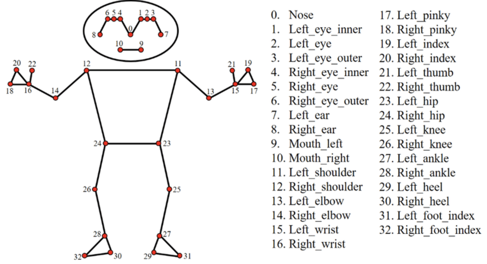

# 🎻 협주가능 악기 레슨 Agent AI 플랫폼 기술 개발: Pose Agent

바이올린 연주자의 자세를 실시간으로 분석하고, 자세 상태와 피드백을 구조화해서 Supervisor Agent에 전달하는 **Pose Agent 프로젝트**입니다.

이 프로젝트는 더 큰 음악 학습 Multi-Agent System 안에서 **Posture/Pose 분석 담당 Agent** 역할을 합니다.  
MediaPipe로 신체 keypoint를 추출하고, biomechanical feature를 계산한 뒤, ML + rule-based logic + Q-table 기반 reward 흐름을 통해 설명 가능한 자세 피드백을 생성합니다.

> If you plan to clone this project, please clone the `clean-version` branch.  
> 프로젝트를 clone할 예정이라면 반드시 `clean-version` 브랜치를 기준으로 받아주세요! 🌿

```bash
git clone -b clean-version <repository-url>
```

---

## 프로젝트 목표 🎯

- 웹캠 또는 비디오 입력에서 연주자의 pose landmark 추출
- 어깨, 팔꿈치, 손목 등 자세 관련 feature 계산
- 좋은 자세와 나쁜 자세를 분류하는 posture score 생성
- 어떤 feature가 문제인지 설명 가능한 피드백 제공
- Supervisor Agent가 사용할 수 있는 `state`, `action`, `reward`, `q-value` payload 생성

The main idea is not just "classify posture", but to make posture feedback explainable and usable by another agent.

---

## 전체 흐름 🧭

```text
Webcam / Video Input
        ↓
PoseExtractor
MediaPipe Pose Landmarker로 landmark 추출
        ↓
FeatureExtractor
거리, 각도, 속도 등 6개 feature 계산
        ↓
Sequence Buffer
일정 시간 동안 feature sequence 축적
        ↓
PoseFeedbackAnalyzer
Logistic Regression + Z-score + rule-based risk 분석
        ↓
Q_PoseRewardUpdater
state/action 선택, reward 계산, Q-table update
        ↓
pose_output.json
Supervisor payload + Pose Agent meta 저장
```

---

## 핵심 로직 🧠

### 1. PoseExtractor

`agent_model/pose_extractor.py`

MediaPipe의 `PoseLandmarker`를 사용해서 프레임마다 사람의 skeleton landmark를 추출합니다.

- 기본 모델: `pose_landmarker_lite.task`
- 입력: OpenCV `VideoCapture`
- 출력: landmark dictionary
- 옵션: landmark를 화면 위에 그려서 실시간 확인 가능

주요 역할:

- RGB frame 변환
- `detect_async()` 기반 pose inference
- presence threshold 이상인 landmark만 필터링
- 주요 관절 연결선과 landmark index 시각화

---

### 2. FeatureExtractor

`agent_model/feature_extractor.py`

추출된 landmark를 posture 판단에 쓰기 좋은 숫자 feature로 변환합니다.

현재 사용하는 feature는 총 6개입니다.

| Index | Feature                  | 의미                         |
| ----- | ------------------------ | ---------------------------- |
| 0     | `wrist_to_shoulder_left` | 왼손목과 왼쪽 어깨 사이 거리 |
| 1     | `shoulder_height_diff`   | 양쪽 어깨 높이 차이          |
| 2     | `wrist_velocity_left`    | 왼손목의 프레임 간 이동량    |
| 3     | `left_elbow_angle`       | 왼쪽 팔꿈치 각도             |
| 4     | `right_elbow_angle`      | 오른쪽 팔꿈치 각도           |
| 5     | `wrist_angle_right`      | 오른쪽 손목 각도             |

각 frame의 feature는 `(6,)` 벡터가 되고, 일정 길이만큼 모이면 `(sequence_length, 6)` 형태의 sequence가 됩니다.

현재 `PoseAgent`에서는 기본적으로 `feedback_interval_seconds`에 맞춰 sequence length를 설정합니다.  
예를 들어 FPS가 30이고 feedback interval이 5초라면 약 `(150, 6)` sequence를 사용합니다.

---

### 3. PoseFeedbackAnalyzer

`agent_model/pose_analyzer.py`

PoseAgent의 핵심 분석기입니다. 단순 ML classifier만 쓰는 것이 아니라, 통계적 deviation과 rule-based interpretation을 같이 사용합니다.

분석 방식:

- `model/pose_model.pkl` 로드
- Logistic Regression classifier로 bad posture probability 계산
- 좋은 자세 데이터의 평균/표준편차를 기준으로 feature별 z-score 계산
- feature 방향성에 따라 risk score 계산
- feature별 contribution과 risk percent 계산
- 최종 posture case와 coaching message 생성

출력 예시:

```json
{
  "case": "GOOD / WARNING / RISKY",
  "final_score": 62.4,
  "classifier_probability": 58.2,
  "biomechanical_risk": 3.41,
  "details": [],
  "summary": {
    "posture": "WARNING",
    "coaching": [],
    "top_issues": []
  }
}
```

실제 코드의 일부 한국어 label은 인코딩 문제로 깨져 있을 수 있지만, 구조적으로는 `안정`, `주의`, `위험`에 해당하는 posture state를 다룹니다.

---

### 4. Q_PoseRewardUpdater

`agent_model/q_pose_reward_updater.py`

Supervisor Agent와 연결하기 위한 reward/action layer입니다. Pose 분석 결과를 state로 바꾸고, 해당 state에 맞는 action을 선택하며, 이전 결과와 현재 결과의 차이를 reward로 계산합니다.

주요 state:

- `GOOD`
- `LEFT_HAND_ALIGNMENT`
- `SHOULDER_IMBALANCE`
- `LEFT_WRIST_MOVEMENT`
- `LEFT_ARM_POSTURE`
- `RIGHT_ARM_BOWING`
- `RIGHT_WRIST_ALIGNMENT`

주요 action:

- `POSITIVE_T`
- `HAND_ALIGNMENT_CORRECT`
- `SHOULDER_BALANCE`
- `WRIST_STRAIGHTEN`
- `ARM_POSTURE_CORRECT`
- `ARM_STRAIGHTEN`
- `WRIST_ALIGNMENT`
- `CALL_SUPERVISOR`

Reward는 이전 final score와 현재 final score의 변화량, posture case 변화, stable state 도달 여부를 기준으로 `-1.0 ~ 1.0` 범위에서 계산됩니다.

---

## PoseAgent Runtime 🔄

`agent_model/pose_agent.py`

`PoseAgent`는 전체 runtime pipeline을 연결하는 main controller입니다.

실행 중 처리 순서:

1. OpenCV로 frame 읽기
2. `PoseExtractor.extract()`로 landmark 추출
3. `FeatureExtractor.compute()`로 feature 계산
4. feature buffer가 충분히 쌓일 때까지 대기
5. feedback interval마다 `PoseFeedbackAnalyzer.analyze()` 실행
6. Supervisor용 state/action/reward/q-value 계산
7. 결과를 `pose_output.json`에 append 저장

`pose_output.json`에는 크게 두 종류의 정보가 저장됩니다.

- `supervisor_payload`: 다른 agent가 읽기 좋은 구조화된 state/action/reward 정보
- `pose_agent_meta`: timestamp, final score, risk, top issues, coaching, transition 정보

---

## 파일 구조 📁

```text
CD_PoseAgent/
├─ main.py                         # PoseAgent 실행 entry point
├─ requirements.txt                # Python dependency list
├─ pose_landmarker_lite.task       # MediaPipe pose model
├─ pose_output.json                # Runtime output log
├─ train.py                        # LogisticRegression posture model 학습
├─ train_tcn.py                    # TCN 학습 실험용 코드
├─ agent_model/
│  ├─ pose_agent.py                # 전체 PoseAgent runtime controller
│  ├─ pose_extractor.py            # MediaPipe 기반 landmark 추출
│  ├─ feature_extractor.py         # 자세 feature 계산 및 sequence buffer
│  ├─ pose_analyzer.py             # ML + rule 기반 자세 분석
│  └─ q_pose_reward_updater.py     # state/action/reward/Q-table 관리
├─ tools/
│  ├─ dataset_collector.py         # 영상에서 dataset 생성
│  ├─ pose_trainer.py              # 자세 분류 모델 학습 및 export
│  └─ visualizer.py                # feature 출력 helper
├─ model/
│  └─ pose_model.pkl               # 학습된 runtime model bundle
├─ data/
│  ├─ datasets/                    # good/bad posture npz datasets
│  └─ analysis/                    # 데이터 분석 notebook
└─ asset/
   ├─ input_good.mp4
   ├─ input_bad.mp4
   └─ keypoints_name.png
```

---

## 설치 및 실행 🚀

### 1. 환경 준비

```bash
pip install -r requirements.txt
```

### 2. 실행

```bash
python main.py
```

현재 `main.py`는 기본적으로 웹캠을 사용합니다.

```python
source = cv2.VideoCapture(0)
```

저장된 영상으로 테스트하고 싶다면 `main.py`에서 아래처럼 바꿔 사용할 수 있습니다.

```python
source = cv2.VideoCapture(str(DEFAULT_VIDEO_PATH))
```

실행 중 `q` 키를 누르면 종료됩니다.

---

## 모델 학습 🧪

현재 runtime 모델은 `model/pose_model.pkl`을 사용합니다.  
새 dataset으로 다시 학습하려면:

```bash
python train.py
```

학습 과정은 `tools/pose_trainer.py`에 정의되어 있습니다.

- good posture dataset: `dataset_good_1.npz` ~ `dataset_good_4.npz`
- bad posture dataset: `dataset_bad_1.npz`
- 입력 shape: `(N, sequence_length, 6)`
- 학습 시 sequence의 median summary를 사용해 `(N, 6)` feature vector로 변환
- 모델: `StandardScaler + LogisticRegression`

---

## Dataset 생성 📦

`tools/dataset_collector.py`는 raw video를 읽어서 feature sequence dataset을 만듭니다.

기본 입력 경로:

```text
data/raw/good
data/raw/bad
```

출력 경로:

```text
data/datasets/dataset_good_*.npz
data/datasets/dataset_bad_*.npz
```

---

## 현재 구현 상태 ✅

- [x] MediaPipe 기반 pose landmark 추출
- [x] OpenCV webcam/video runtime 연결
- [x] 자세 feature 6개 계산
- [x] sequence buffer 기반 분석 입력 생성
- [x] Logistic Regression 자세 분류 모델 학습 및 저장
- [x] z-score 기반 feature deviation 분석
- [x] rule-based coaching feedback 생성
- [x] Pose state mapping
- [x] Q-table 기반 action 선택 및 reward update
- [x] Supervisor Agent 연동용 payload 생성
- [x] `pose_output.json` runtime logging
- [ ] Pitch/Rhythm Agent와의 완전 통합
- [ ] 실제 Supervisor Agent와의 end-to-end orchestration
- [ ] TCN/LSTM 기반 sequence model 고도화

---

## 기술 스택 🛠️

- Python
- OpenCV
- MediaPipe
- NumPy
- scikit-learn
- joblib
- PyTorch, for TCN experiments

---

## MediaPipe Keypoints 🧍

MediaPipe pose landmark index는 아래 이미지를 참고합니다.



---

## 정리 ✨

이 프로젝트의 PoseAgent는 단순히 자세를 좋다/나쁘다로 판단하는 모듈이 아니라, **왜 문제가 생겼는지**, **어떤 feature가 위험한지**, **다음 action으로 무엇을 선택할지**까지 구조화하는 agent입니다.

In short: PoseAgent converts raw movement into explainable posture states for an AI coaching system.
